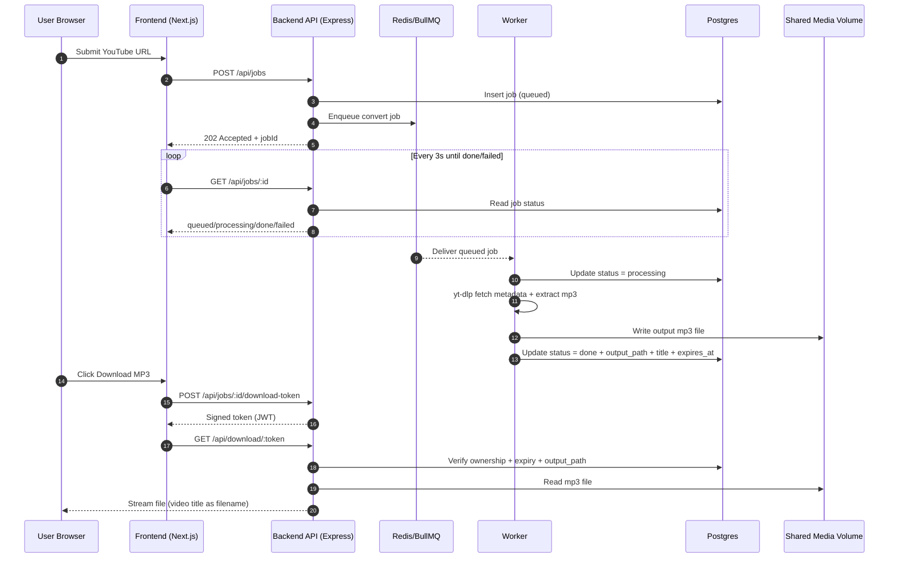

# yt-to-mp3

Standalone YouTube-to-MP3 web app scaffold with optional sign-in, queue worker processing, and local Docker-first deployment.

## Services

- `frontend` - Next.js UI for guest and signed-in job submission.
- `backend` - Express API for job creation/status/download tokens.
- `worker` - BullMQ worker for conversion pipeline (`yt-dlp` + `ffmpeg`).
- `redis` - Queue broker.
- `postgres` - Job metadata storage.

## Architecture Sequence

## Quick Start

1. Copy `.env.example` to `.env` and adjust values.
2. Run `docker compose up --build` from the project root.
3. Open `http://localhost:3000`.

## Notes

- This scaffold enforces a 15-minute max duration by default.
- Guest mode is enabled via signed cookie sessions.
- Signed-in mode is currently header-based placeholder (`x-user-id`) and should be replaced with OAuth/email auth in the next phase.
